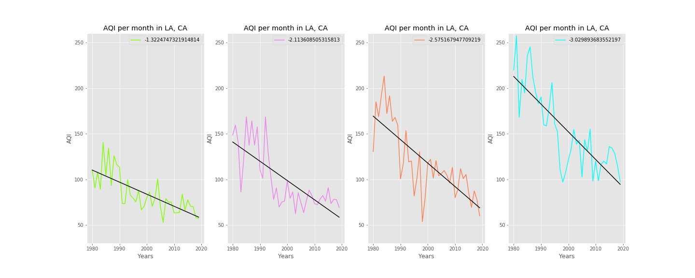

# COVID: Bad for lungs; good for air?

The COVID-19 outbreak that hit the US shores in February 2020 fundamentally changed the societal operations to which we'd grown accustomed.  Restaurants, bars, schools, and gyms were shut down; air traffic plummeted. And all this got me thinking: has the Air Quality Index (AQI) in major metropolitan areas across the US significantly decreased in 2020, specifically in the months from March-June(~approx present)? Has decreased air and vehicular travel, an expansion of remote work, combined with other factors in the COVID-19 era resulted in a noteworthy shift in AQI from what we would otherwise expect?  Let's check out what the numbers have to say.

# Background

##### Why is Air Quality Index (AQI) an important statistic and who does it affect?
 - AQI gives us a measure of the quality of the air we breath, and most importantly lets us know when prolonged exercise and exposure might be harmful to human health.  For at least 1 in 13 of us - this is the rate of Asthma in the US - and others afflicted by respirtory illnesses, the AQI directly informs whether or not outdoor activity is safe and for how long.  For many suffering from respirtory illnesses, the average AQI in a given city may even dictate where they choose to live.  If you are in this population, it's likely you reference the AQI on a daily basis.  
 
##### What goes in to calculating the AQI?
  - AQI is calculated based on four main factors: Ozone, Carbon Monoxide, Sulfur Dioxide, and Particle Pollution.
    Each of the factors vary in the degree to which their concentration is considered harmful, and to handle this each factor         is normalized from a ppm (parts per million) value to AQI.  
  - When the statistic was first measured and recorded in 1968, it was summarized into a single AQI value (0-500),         
    and since 1980 they have offered the AQI in each category in addition to the single defining AQI value.
  - The tireless and scrupulous work of environmental scientists at over 3000 monitoring sites who sample the air on an hourly         basis and take great care to calibrate their equipment with regularity. 
  
 
  
 
For a helpful brochure check out https://www.airnow.gov/sites/default/files/2018-04/aqi_brochure_02_14_0.pdf

# About the Data
AQI data is available at https://aqs.epa.gov/aqsweb/airdata/download_files.html#AQI

I chose to look at Daily AQI per CBSA (metro-area) for the years 1980-2019 which was available in form of .csv.
The 2020 data for March-June was accessed from their AirNow API at https://docs.airnowapi.org/ in form of JSON.

AQI varies throughout the seasons, and to answer my question if COVID era AQI is significantly different I trimmed the historic data to dates 03/01/YEAR  -  06/30/YEAR to avoid data in the irrelevant months.  This was done yearly dataframe by yearly dataframe, as the resulting trimmed cumulative dataframe was still in excess of 3.8 million rows. This script and all others can be referenced in the scripts repository.

Before looking around at the historic data I claried my null and alternative hypotheses.  
        Null Hypothesis: There is no difference in mean AQI from 03/01/2019 - 06/30/2019 vs 2020.
        Alternative Hypothesis: There is a signficant difference in mean AQI from 2019 to 2020.
            

Well **hold it** right there partner.  Where does 1980-2019 data come in to play with a null hypothesis that is only comparing 2019 to 2020?  Great question.  As I began exploring the data, plotting the mean AQI per year in each CBSA, my plan was to use the slope of the best fit line to inform the expected change we should see from 2019 to 2020, and take this expected difference into account for the significance test calculation. But using data from the 80's, nearly every city has seen a marked decrease in AQI from 1980-2019, a slope that would have our AQI in the future crossing the X-axis.  

Here is a quick look just for an example we'll use Los Angeles: 

Predicting the 2020 average AQI rate (for each CBSA) is a problem best addressed by time series analysis. Fitting a simple regression line involved risking a potential negative average AQI value (which in life is not possible). Due to time constraints, time series analysis is out of scope for the particular project, but keep tabs with my github for this future project. 

Now let's have a look at some charts. As mention previously AQI has decreased across the board for metro areas in the US since the 1980's

Additionally, AQI changes with the seasons, with warmer months trapping more Ozone and CO we observe an increase in AQI.

Warmer months resulting in higher AQI values is not a truth across the board.  There is great dependence on the location, averge temperature per month, and how cold and how long the winters last.  One aspect of AQI - particle pollution - is influenced most notably by wood burning fires.  In regions where wood burning fires are a common source of heat, and the winters are long, the AQI may be at its worst in the winter months.  

# Methods/Results

To test my null hypothesis I chose to perform a students T-test. This is an appropriate test to measure if there is a difference between two populations following a normal distribution with a known mean and standard deviation. For the T-test the historic dataframe was whittled down to the 2019 values and mapped to the selected 58 metro areas.  For this I had to make a relational dictionary as the historic data listed the CBSA's differently than the 2020 data.  Using the power of scipy stats, I looped through the dataframe grouped by CBSA and year, comparing their mean AQI in 2019 to 2020. 

The tables below were split into three parts for ease of viewing. Values for each CBSA are mean AQI per year, Standard deviation, the t-statistic, p_value, and a value of 1 in the null_rejection column indicates we can reject the null hypothesis; 0 we cannot. An alpha value of 0.05 wad adopted per convention.   

So how many time were we able to reject the null hypothesis?

As we can see there are 34 metro areas which showed a significant difference in their mean AQI from March-June 2020 as compared to their mean AQI from March-June 2019, and 24 metro areas which failed to reject the null hypothesis.  But let's visualize.

This is our first quick visual showing the 58 CBSAs AQI is either about the same from 2019-2020 or there is a decrease.

Next is a more robust visual.  

What these bar graphs illustrate is that a bar showing a dark blue tip had a lower 2020 mean AQI, with the size of the tip indicating the proportional change. Bars showing a cyan tip have a higher 2020 mean AQI. From the graphs alone we're not able to tell if these differences are significant (we use the ttest for that), but in general again we can see most have a decreased mean AQI, or an AQI which has increased by a small amount.  

Let's zero in on a few outliers for fun. Here are the top 5 and bottom 5 CBSAs in terms of mean AQI difference from 2019-2020.

Top 5

Have NY and LA seen the most drastic drop in plane and automobile traffic? Has residual effects from wildfires in LA totally skewed their 2019 data as compared to 2020? 

Bottom 5

Two cities show up from two states: Michigan and Texas.  Has there been no change in activity in these regions since COVID began? Famous photo of protesters in Michigan state house. Everything is Texas in Texas.  
 

# Further Study

This AQI analysis in the age of COVID-19 has demonstrated that more metro areas than not are reporting statistically significant changes in AQI as compared to last year (2019), and for the better.  And while this more straight foward question has been addressed, we've truly only pulled the first russian doll from the outer shell.  What else lies inside?  To what degree has air traffic and vehicle traffic declined in each CBSA? What is the percentage per capita of remote workers in each CBSA, and how much has it expanded since COVID-19 reared its head?  

Useful link on remote work data before COVID: https://www.moneypenny.com/us/resources/blog/remote-work-statistics/

When did each of these CBSAs implement stay at home orders or other restrictions, and to what degree were they followed or enforced?  Which of the regions have seen the greatest number of COVID-19 cases and when did they arrive? And at the heart of these confounding variables: how much can human activity in the span of 4 months affect our environment, and what lessons from this data should be drawn?  

I hope to continue on with this project using the more robust and accurate time series analysis, folding in the aforementioned variables as data traffic data and remote work data become available in the coming months.  And if this project sparks interest in another able body, please reach out so we can discuss and potentially collaborate.  

Thanks for joining.  

            

